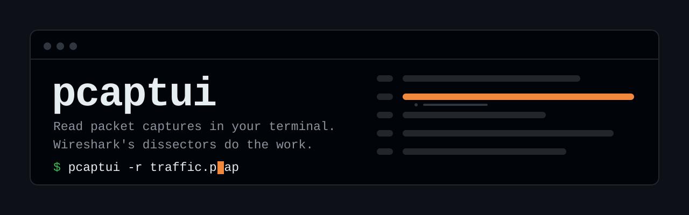
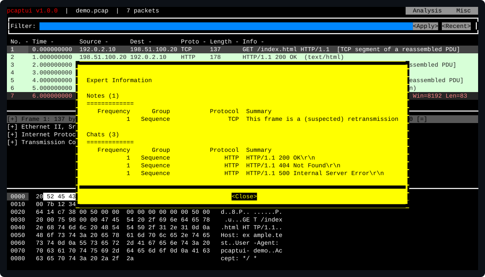

<p align="center">
  
</p>

<p align="center">
  <a href="https://github.com/m1rwana12/pcaptui/actions/workflows/ci.yml"></a>
  <a href="https://github.com/m1rwana12/pcaptui/releases/latest"></a>
  <a href="https://pkg.go.dev/github.com/m1rwana12/pcaptui"></a>
  <a href="LICENSE"></a>
  
</p>

<p align="center"><b>English</b> · <a href="README.uk.md">Українською</a></p>

<h3 align="center">Wireshark's analysis, where the capture already is.</h3>

<p align="center">
  <code>pcaptui</code> is a terminal interface to <code>tshark</code>: the packet list, the protocol
  tree and the hex view, over SSH, on a machine with no display — without copying a
  2&nbsp;GB capture back to your desktop first.
</p>

<p align="center">
  
</p>

<p align="center">
  <sub><b>y</b> what is in this file · <b>e</b> what is wrong with it · <b>enter</b> land on those packets</sub>
</p>

```bash
go install github.com/m1rwana12/pcaptui/cmd/pcaptui@latest

pcaptui -r traffic.pcap          # a file
pcaptui -i eth0 'port 443'       # an interface
tcpdump -w - port 53 | pcaptui -r -
```

Needs [`tshark`](https://www.wireshark.org) on your `PATH` — anything from the last
decade. `pcaptui` says so plainly if it cannot find it, rather than failing later in
a way that looks like a broken capture.

---

## What you get

**A capture you can move around in.** A scrolling packet list, a protocol tree you
can expand, and a hex pane that highlights the bytes of whichever field you select.
`tcpdump` prints lines; this lets you look.

**Wireshark's display filters, checked as you type.** The same syntax, with the
filter box turning red before you press enter. A filter given on the command line is
checked too — a typo stops the program with `tshark`'s own explanation instead of
opening an empty window.

**Every dissector Wireshark has, and every one it gains.** `pcaptui` has no
protocol knowledge of its own and no opinions about protocols. It asks `tshark`.
When Wireshark learns a new protocol, so does this — with no release here.

**Answers, not just packets.** Expert Information says what the dissectors think is
wrong with the capture; Protocol Hierarchy says what is in it. Both are tables you
can act on: press enter on a row and the packet list narrows to the packets that row
is about.

**It says when it is showing you less than everything.** A column too narrow for its
value ends in `…` rather than quietly showing a shorter address; the title bar says
how many packets there are and whether a filter is why the list looks short; a
statistic that matched nothing says so in words instead of opening an empty box.

---

## Analysis

Eight views, one key each — the same key that appears beside them in the Analysis
menu.

| Key | | |
|---|---|---|
| `o` | **Overview** | all three questions at once, on one screen |
| `e` | Expert Information | what the dissectors think is wrong |
| `y` | Protocol Hierarchy | what is in this capture, as a tree |
| `t` | Endpoints | who is on the wire, busiest first |
| `w` | HTTP | how the HTTP responses turned out, by status |
| `v` | Conversations | who talked to whom, by packets and bytes |
| `s` | Reassemble stream | follow the conversation this packet is in |
| `p` | Capture file properties | size, duration, encapsulation, hashes |

<p align="center">
  
</p>

Both Expert Information and Protocol Hierarchy respect the display filter in force,
so you can ask them about a subset, and both name the filter at the top of the
result.

## Decrypting TLS

If you have the session keys, you see the plaintext:

```bash
export SSLKEYLOGFILE=~/keys.log     # then start your browser or run curl
pcaptui --tls-keylog ~/keys.log -r traffic.pcap
```

`pcaptui` checks the key log before it starts and refuses to run if the file is
missing or unreadable. `tshark` accepts a key log path that does not exist, starts
normally, exits zero and decrypts nothing — so a typo would otherwise be
indistinguishable from traffic whose keys you never had.

## Moving around

| | |
|---|---|
| `/` | display filter |
| `tab` | switch panes |
| <code>&#124;</code> `\` | pane layout, pane zoom |
| `ctrl-f` | search — by filter, hex, text, or regex |
| `ma` `'a` | mark a packet, jump back to it |
| `c` | copy mode — packets, fields, or the whole stream |
| `?` | everything else |

Vim keys work throughout. So does the mouse, in most terminals.

## Is this for you?

**Yes, if** the capture is on a server, or is too big to move, or you already know
Wireshark's filters and want them where the traffic is.

**Probably not, if** you are on a desktop with Wireshark installed and the file is
in front of you. Wireshark's GUI is better than any terminal can be. This exists for
when you cannot have it.

## Documentation

- [User Guide](docs/UserGuide.md) — every view, every key, every setting
- [FAQ](docs/FAQ.md) — colours, terminals, live capture, reporting a bug
- [Changelog](CHANGELOG.md) — what changed and why it was wrong before
- [Contributing](docs/Contributing.md) — how to build it and what CI checks

## Built with

[gowid](https://github.com/gcla/gowid) and [tcell](https://github.com/gdamore/tcell)
for the terminal interface, and [Wireshark](https://www.wireshark.org)'s `tshark`
for every byte of the analysis.

<sub>The images above are drawn by the program itself, from
<a href="scripts/pcaps/demo.pcap"><code>scripts/pcaps/demo.pcap</code></a> and
<a href="scripts/pcaps/telnet-cooked.pcap"><code>telnet-cooked.pcap</code></a>, and
CI fails if they stop matching what it renders — so they cannot go stale.</sub>

## Licence

MIT. See [LICENSE](LICENSE).

`pcaptui` is built on the codebase of [termshark](https://github.com/gcla/termshark)
by Graham Clark, used under the MIT licence.
