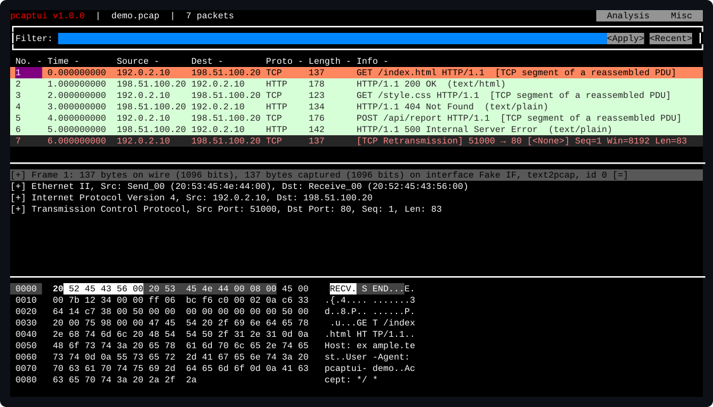

<p align="center">
  
</p>

<p align="center">
  <a href="https://github.com/m1rwana12/pcaptui/actions/workflows/ci.yml"></a>
  <a href="https://github.com/m1rwana12/pcaptui/releases/latest"></a>
  <a href="https://pkg.go.dev/github.com/m1rwana12/pcaptui"></a>
  <a href="LICENSE"></a>
  
</p>

<p align="center"><b>Українською</b> · <a href="README.md">English</a></p>

`pcaptui` — це термінальний інтерфейс до `tshark`. Він дає список пакетів,
дерево протоколів і шістнадцятковий вигляд — усе те, що ви отримали б від
Wireshark, — по SSH, на машині без графіки, не копіюючи двогігабайтний файл
захоплення до себе на стіл.

```bash
pcaptui -r traffic.pcap
pcaptui -i eth0 'port 443'
```

<p align="center">
  
</p>

<sub>Це зображення малює сама програма з файлу
<a href="scripts/pcaps/demo.pcap"><code>scripts/pcaps/demo.pcap</code></a>, і CI
падає, щойно воно перестає збігатися з тим, що програма малює насправді, — тож
воно не може застаріти.</sub>

## Навіщо

Wireshark — найкращий аналізатор протоколів, який існує, і `tshark` несе його
цілком: кожен дисектор, кожен фільтр відображення, кожну статистику. Чого
`tshark` не дає — це способу рухатися захопленням: немає прокручуваного списку
пакетів, немає розгортаного дерева протоколів, немає можливості клацнути по
полю й побачити байти, з яких воно взялося.

`pcaptui` дає саме це, а весь аналіз віддає `tshark`. Він не має власних
дисекторів і жодних поглядів на протоколи. Коли Wireshark вивчає новий
протокол — його вивчає й ця програма.

## Що потрібно

`tshark` із [Wireshark](https://www.wireshark.org). Версія 1.10.2 або новіша —
підійде будь-що за останнє десятиліття. Якщо `pcaptui` його не знайде, він так
і скаже.

Для живого захоплення потрібні ще й права на захоплення — у Linux це зазвичай
означає `dumpcap` із відповідними можливостями, і пакети Wireshark налаштовують
це за вас.

## Встановлення

```bash
go install github.com/m1rwana12/pcaptui/cmd/pcaptui@latest
```

Бінарник опиниться в `~/go/bin`. Це один статичний виконуваний файл без жодних
залежностей у рантаймі, крім самого `tshark`.

## Що він уміє

**Читати захоплення або дивитися живий трафік.** Файли, іменовані канали,
стандартний ввід чи мережевий інтерфейс. Живе захоплення тече в той самий
вигляд, і його можна фільтрувати просто під час запису.

**Фільтрувати фільтрами відображення Wireshark.** Той самий синтаксис, який
перевіряється під час набору — рядок фільтра червоніє, щойно вираз стає
недійсним.

**Стежити за потоками TCP і UDP.** Зібраними докупи, у тексті або
шістнадцятково, в один бік або в обидва.

**Бачити розмови за протоколами.** Відсортовані за пакетами чи байтами, і
будь-який рядок можна одразу перетворити на фільтр відображення.

**Шукати.** За фільтром відображення, за шістнадцятковими байтами, за текстом у
структурі пакета або за текстом у списку пакетів.

**Копіювати будь-що.** Діапазони пакетів, окремі поля, зібраний потік — у
системний буфер обміну або через термінал із підтримкою OSC 52, коли ви на
віддаленій машині.

### Експертна інформація

Те, що дисектори вважають неправильним у захопленні: ретрансмісії, пошкоджені
пакети, збої контрольних сум, порушення протоколів — згруповані за важливістю,
найгірше згори.

```
:expert
```

<p align="center">
  
</p>

Зазвичай це найшвидший спосіб знайти проблему в захопленні, яке вам щойно
передали, не читаючи його пакет за пакетом.

### Ієрархія протоколів

Кожен наявний протокол із кількістю пакетів і байтів, деревом. Відповідає на
питання «що взагалі є в цьому файлі» одним екраном.

```
:hierarchy
```

Обидва вигляди звужуються до застосованого фільтра відображення — так само, як
у Wireshark, — і обидва прямо кажуть, коли фільтр нічого не знайшов, замість
показувати порожнє вікно.

### Розшифрування TLS

Якщо у вас є сеансові ключі, ви бачите відкритий текст:

```bash
export SSLKEYLOGFILE=~/keys.log     # потім запустіть браузер або curl
pcaptui --tls-keylog ~/keys.log -r traffic.pcap
```

`pcaptui` перевіряє файл ключів перед запуском і відмовляється працювати, якщо
той відсутній або нечитабельний. Ця перевірка важливіша, ніж здається: `tshark`
приймає неіснуючий шлях до файлу ключів, стартує як звичайно, виходить із кодом
нуль і **нічого не розшифровує, не сказавши ні слова** — тож описка в шляху
виглядає точнісінько як трафік, ключів до якого у вас ніколи й не було.

## Налаштування

Налаштування живуть у `pcaptui.toml`, у теці конфігурації вашої платформи.
Виконайте `:config`, щоб побачити де саме. Усе має робочі значення за
замовчуванням; файл потрібен лише тоді, коли ви хочете чогось іншого.

## Документація

- [Посібник користувача](docs/UserGuide.md) — кожен вигляд, кожна клавіша, кожне налаштування
- [Часті питання](docs/FAQ.md) — ті, що справді виникають
- [Участь у розробці](docs/Contributing.md) — збірка, тести, релізи
- [Бренд](docs/Brand.md) — як цей проєкт виглядає і звучить
- [Політика безпеки](SECURITY.md) — що тут вважається вразливістю

Документація в `docs/` — англійською.

## На чому побудовано

[gowid](https://github.com/gcla/gowid) для термінальних віджетів, поверх
[tcell](https://github.com/gdamore/tcell).

## Ліцензія

MIT. Copyright (c) 2026 m1rwana12 — див. [LICENSE](LICENSE).
